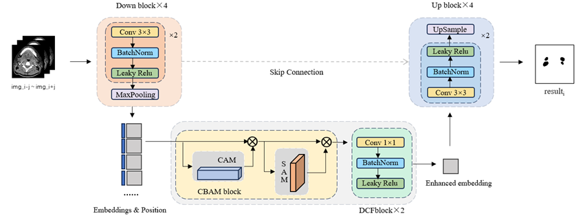

# CBAM-Enhanced U-Net for Lymph Node Analysis

## Overview

Lymph node metastasis is a key indicator in diagnosing and treating head and neck cancers. Accurate detection and segmentation are crucial for clinical decision-making. This repository tackles two major challenges in medical image analysis:

- **Efficient Spatial Feature Modeling**: Leveraging the CBAM to enhance U-Net's spatial and channel attention capabilities while maintaining lightweight design.
- **Multi-Task Learning**: Simultaneously optimizing detection and segmentation tasks to leverage task interdependence.

<p align="center">

</p>

## Installation

- Clone the repository
- Create a conda environment
```bash
conda create -n lymphnode python=3.12
conda activate lymphnode
```
- Install dependencies
```bash
pip install -r requirements.txt
```

## Dataset Preparation

Due to privacy concerns, the dataset cannot be publicly shared. However, a pretrained model (`model.pt`) is provided for use and further fine-tuning. For model inference or fine-tuning, download the pretrained weights from [here](https://www.kaggle.com/datasets/lyrua0426/lymphnode/settings).
